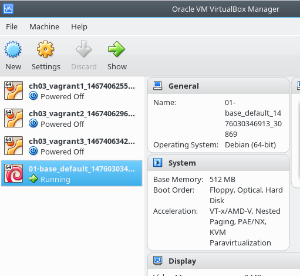
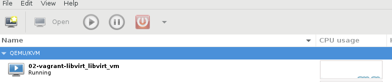

Vagrant, hypervisors, debian automated install and other rants
##############################################################

What is Vagrant?
----------------

* A person without a settled home or regular work who wanders from place to place and lives by begging.
* Vagrant is an Open-source software product for building and maintaining portable virtual development environments
* Vagrant provides easy to configure, reproducible, and portable work environments.

Why Vagrant is useful?
----------------------

* Vagrant provides fully virtualized OS environment that can be build in seconds
* You need to debug a script, and a vargrant is your os undo button

Installing Vagrant
------------------

.. code-block:: bash

    # apt-get install vagrant

* This command will also pull virtualbox

Getting a Vagrant box
---------------------

* let's use a debian image
* Go to https://atlas.hashicorp.com/boxes/search
* https://atlas.hashicorp.com/debian/boxes/jessie64
* Box name is debian/jessie64

Downloading a box on the system
-------------------------------

.. code-block:: bash

    $ vagrant box add debian/jessie64
    ==> box: Loading metadata for box 'debian/jessie64'
        box: URL: https://atlas.hashicorp.com/debian/jessie64
    ==> box: Adding box 'debian/jessie64' (v8.6.1) for provider: virtualbox
        box: Downloading: https://atlas.hashicorp.com/debian/boxes/jessie64/versions/8.6.1/providers/virtualbox.box
    ==> box: Successfully added box 'debian/jessie64' (v8.6.1) for 'virtualbox'!

Starting up a Vagrant box
-------------------------

* Add file named *Vagrantfile* with the following content

.. code-block:: ruby

    Vagrant.configure("2") do |config|
        config.vm.box = "debian/jessie64"
    end

Starting up a Vagrant box
-------------------------

* From the directory where *Vagrant* file is located
* Bring up the box:

.. code-block:: bash

    $ vagrant up

test test test

Display vagrant machine ssh configuration
-----------------------------------------

.. code-block:: bash

    $ vagrant ssh-config
    Host default
        HostName 127.0.0.1
        User vagrant
        Port 2222
        UserKnownHostsFile /dev/null
        StrictHostKeyChecking no
        PasswordAuthentication no
        IdentityFile /home/alex/git/gtalug/2016-10-11-ansible/2-testing/01-base/.vagrant/machines/default/virtualbox/private_key
        IdentitiesOnly yes
        LogLevel FATAL

Log into vagrant box
--------------------

.. code-block:: bash

    $ vagrant ssh

Ansible machine configuration ansible.cfg
-----------------------------------------

.. code-block:: ini

    [defaults]
    hostfile = hosts
    remote_user = vagrant
    private_key_file = .vagrant/machines/default/virtualbox/private_key
    host_key_checking = False

Ansible hosts file
------------------

.. code-block:: ini

    [test]
    testserver ansible_ssh_host=127.0.0.1 ansible_ssh_port=2222

Testing SSH connectivity
-----------------------

.. code-block:: bash

    $ ansible test -m ping
    testserver | SUCCESS => {
        "changed": false,
        "ping": "pong"
    }

Running script on vagrant box
-----------------------------

.. code-block:: bash

    $ ansible-playbook -vvv base-packages.yaml

Using different hypervisors
---------------------------

* This works however virtualbox is not a preferred hypervisor.
* It is not possible to run more than one hypervisor at a time.

Download vagrant libvirt box
---------------------------

.. code-block:: bash

    # apt-get install vagrant-libvirt
    $ vagrant box add debian/jessie64 --provider=libvirt

libvirt Vagrantfile configuration
---------------------------------

..code-block:: ruby

    VAGRANTFILE_API_VERSION = "2"
    Vagrant.configure("2") do |config|
        config.vm.provider :libvirt do |libvirt|
            libvirt.host = 'localhost'
            libvirt.username = 'alex'
            libvirt.connect_via_ssh = true
        end
        config.vm.define :libvirt_vm do |machine|
            machine.vm.box = "debian/jessie64"
        end
    end

Start up vagrant libvirt box
----------------------------

..code-block:: bash

    $vagrant up --provider=libvirt

Vagrant libvirt box is running
------------------------------

Vagrant ssh config for virtualbox is different
----------------------------------------------

..code-block:: bash

    $ vagrant ssh-config
    Host libvirt_vm
      HostName 192.168.121.237
      User vagrant
      Port 22
      UserKnownHostsFile /dev/null
      StrictHostKeyChecking no
      PasswordAuthentication no
      IdentityFile /home/alex/git/gtalug/2016-10-11-ansible/2-testing/02-vagrant-libvirt/.vagrant/machines/libvirt_vm/libvirt/private_key
      IdentitiesOnly yes
      LogLevel FATAL
      ProxyCommand ssh 'localhost' -l 'alex' -i '/home/alex/.ssh/id_rsa' nc %h %p

Update ansible.cfg settings
---------------------------

* Set a new path to private_key_file

.. code-block:: ini
    private_key_file = .vagrant/machines/libvirt_vm/libvirt/private_key

Update hosts settings
---------------------

.. code-block:: ini
    vagrant_libvirt ansible_ssh_host=192.168.121.237 ansible_ssh_port=22

Run ansible ping command
------------------------

.. code-block:: bash
    $ ansible test -m ping
    testserver | SUCCESS => {
        "changed": false,
        "ping": "pong"
    }

Running ansible script agains vagrant box
-----------------------------------------

.. code-block:: bash

    $ ansible-playbook -ilocalhost, --ssh-common-args="-P 2222" -vvv base_packages.yaml

Getting foot in the door
------------------------

* First run copy ssh pubkey and some other stuff

.. code-block:: bash

    $ ansible-playbook --ask-pass --ask-become-pass --ssh_port=2222 -i<hostname>, -vvv base_packages.yaml

* Backup command if script fails and you need to debug it

.. code-block:: bash

    $ ansible-playbook -i<hostname>, -vvv base_packages.yaml

Comma after hostname is important
-------------------

* http://stackoverflow.com/questions/18195142/safely-limiting-ansible-playbooks-to-a-single-machine
* http://stackoverflow.com/questions/17188147/how-to-run-ansible-without-specifying-the-inventory-but-the-host-directly

Installing OpenSource hypervisor providers
-------------------------------------------

.. code-block:: bash

    # apt-get install vagrant-lxc vagrant-libvirt vagrant-mutate

* vagrant-lxc, vagrant-libvirt -- lxc and libvirt available in stretch and newer
* vagrant-mutate -- convert original images to lxc/libvirt

If packages aren't available
----------------------------

.. code-block:: bash

    $ vagrant plugin install vagrant-lxc vagrant-libvirt vagrant-mutate

Loading Debian Preseed in USB/CD images
---------------------------------------

* using preseeding -- https://www.debian.org/releases/jessie/i386/apbs02.html.en
* edit iso -- https://wiki.debian.org/DebianInstaller/Preseed/EditIso
* Really fragile!

Loop mount ISO images and copy the content
-------------------------------------------

.. code-block:: bash

    # mkdir loopdir
    # mount -o loop debian-8.5.0-amd64-CD-1.iso loopdir
    # mkdir cd
    # rsync -a -H --exclude=TRANS.TBL loopdir/ cd
    # umount loopdir

Hack initrd
-----------

.. code-block:: bash

    # mkdir irmod
    # cd irmod
    # gzip -dc ../cd/install.amd/initrd.gz | \
        cpio --extract --verbose --make-directories --no-absolute-filenames

Copy config file to preseed.cfg and assemble initrd
---------------------------------------------------

.. code-block:: bash

    # cp ../mail-template-selections.conf preseed.cfg
    # find . | cpio -H newc --create --verbose | gzip -9 > ../cd/install.amd/initrd.gz
    # cd ../
    # rm -rf irmod

Generate an image
-----------------

.. code-block:: bash

    # genisoimage -o debian-amd64-preseed.iso -r -J -no-emul-boot -boot-load-size 4  \
        -boot-info-table -b isolinux/isolinux.bin -c isolinux/boot.cat ./cd

